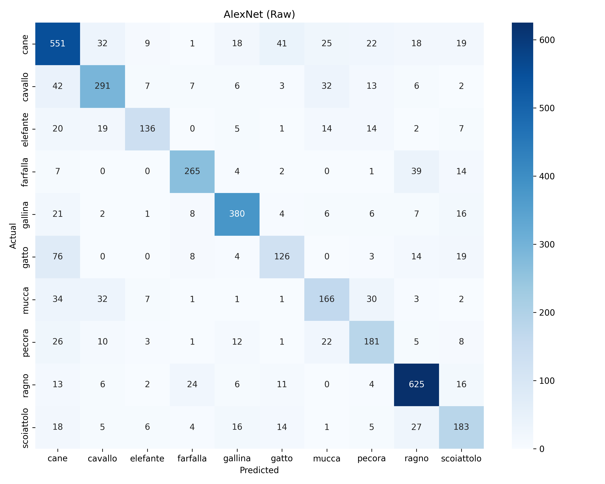
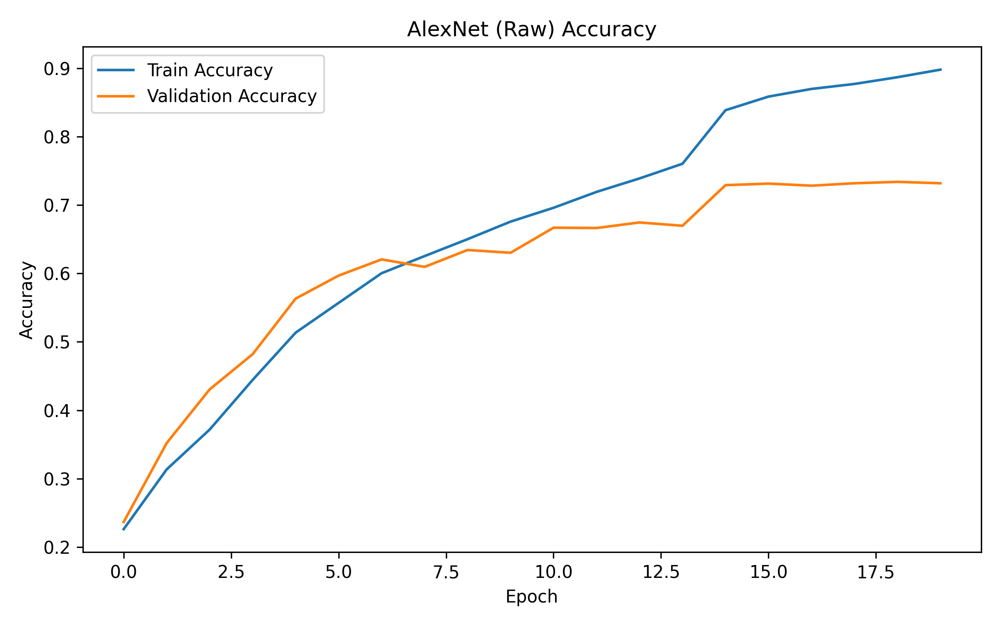
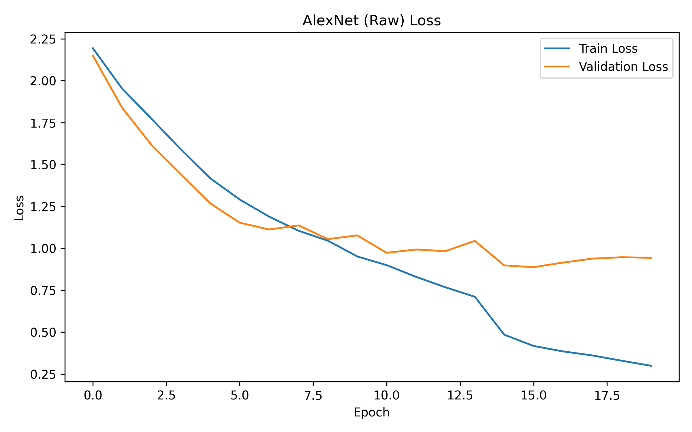

# 🐾 Animals-10 Image Classification (AlexNet)

A **production-ready, modular deep learning application** that classifies images of animals into 10 classes using a **custom AlexNet** architecture. 

This project is a faithful, production-refactored implementation of a validated experiment. The **authoritative Jupyter notebook** (`notebooks/animals-10-classification-updated.ipynb`) is the **single source of truth** — the production code preserves its exact architecture, preprocessing, training, and inference behavior. The pre-trained model weights are **loaded** from `artifacts/` and are **never retrained or regenerated**.

---

## 📋 Table of Contents

- [🐾 Animals-10 Image Classification (AlexNet)](#-animals-10-image-classification-alexnet)
  - [📋 Table of Contents](#-table-of-contents)
  - [🚀 Project Overview](#-project-overview)
  - [🧠 CNN Architecture](#-cnn-architecture)
    - [Custom AlexNet (Best Model)](#custom-alexnet-best-model)
  - [💽 Dataset](#-dataset)
  - [📊 Results](#-results)
  - [🎈 Confusion Matrix](#-confusion-matrix)
  - [📋 Classification Report](#-classification-report)
  - [📈 Training Graphs](#-training-graphs)
  - [🗂️ Folder Structure](#️-folder-structure)
  - [🔧 Installation](#-installation)
    - [1. Clone the repository / navigate to the project](#1-clone-the-repository--navigate-to-the-project)
    - [2. Create a virtual environment (recommended)](#2-create-a-virtual-environment-recommended)
    - [3. Install dependencies](#3-install-dependencies)
  - [🚀 Usage](#-usage)
    - [Streamlit Web App](#streamlit-web-app)
    - [Final Validation](#final-validation)
    - [Command-Line Prediction](#command-line-prediction)
    - [Training (Reproducibility Only)](#training-reproducibility-only)
  - [🧩 Model Architecture Diagram](#-model-architecture-diagram)
  - [💡 Future Improvements](#-future-improvements)
  - [📄 License](#-license)
  - [🙏 Acknowledgments](#-acknowledgments)
  - [👤 Author](#-author)

---

## 🚀 Project Overview

The **Animals-10** dataset contains images of 10 animal species. The project trains a custom **AlexNet** from scratch, compares it against other custom architectures (MiniCNN, LeNet), and selects the **best model** (AlexNet trained on raw data) for production inference.

The production application provides:
- A **Streamlit** web interface for image classification.
- **Top-5 predictions** with confidence scores.
- **Backend selection** (PyTorch default, ONNX optional).
- **Model information** (architecture, framework, metrics).
- **Display** of the existing notebook outputs (plots, confusion matrix, classification report).

> **Key constraint:** The notebook is the single source of truth. The production code does **not** modify the architecture, preprocessing, transforms, or business logic. It only loads the existing trained artifacts.

---

## 🧠 CNN Architecture

### Custom AlexNet (Best Model)

The best model is a **custom AlexNet** trained on the **raw** dataset.

| Layer Type | Details |
|------------|---------|
| Conv2d | 3 → 64, kernel 11, stride 4, padding 2 |
| ReLU | — |
| MaxPool2d | kernel 3, stride 2 |
| Conv2d | 64 → 192, kernel 5, padding 2 |
| BatchNorm2d | 192 |
| ReLU | — |
| MaxPool2d | kernel 3, stride 2 |
| Conv2d | 192 → 384, kernel 3, padding 1 |
| ReLU | — |
| Conv2d | 384 → 256, kernel 3, padding 1 |
| ReLU | — |
| Conv2d | 256 → 256, kernel 3, padding 1 |
| ReLU | — |
| MaxPool2d | kernel 3, stride 2 |
| AdaptiveAvgPool2d | (1, 1) |
| Flatten | — |
| Linear | 256 → 128 |
| ReLU | — |
| Dropout | 0.5 |
| Linear | 128 → 10 |

**Training setup:**
- Optimizer: `AdamW(lr=1e-3, weight_decay=1e-4)`
- Scheduler: `ReduceLROnPlateau(mode='min', factor=0.1, patience=2, min_lr=1e-6)`
- Loss: `CrossEntropyLoss`
- Early stopping: patience = 5
- Batch size: 32, Image size: 224×224, Seed: 42

**Preprocessing (inference):**
```
Resize(224, 224) → ToTensor() → Normalize(mean=[0.485,0.456,0.406], std=[0.229,0.224,0.225])
```

---

## 💽 Dataset

The **Animals-10** dataset consists of 10 animal classes with approximately **26,179** images:

`cane` (dog), `cavallo` (horse), `elefante` (elephant), `farfalla` (butterfly), `gallina` (chicken), `gatto` (cat), `mucca` (cow), `pecora` (sheep), `ragno` (spider), `scoiattolo` (squirrel).

The dataset is split into **70% train / 15% validation / 15% test** using a fixed seed (42) for reproducibility.

---

## 📊 Results

The comparison of all models on the test set:

| Model | Dataset | Parameters | Test Accuracy | Precision | Recall | F1 Score |
|-------|---------|-----------|---------------|-----------|--------|----------|
| **AlexNet** | **Raw** | **2,504,266** | **0.7393** | **0.7390** | **0.7393** | **0.7377** |
| LeNet | Raw | 136,906 | 0.6841 | 0.6822 | 0.6841 | 0.6801 |
| MiniCNN | Raw | 102,602 | 0.6107 | 0.6302 | 0.6107 | 0.6021 |
| MiniCNN | Augmented | 102,602 | 0.5359 | 0.5360 | 0.5359 | 0.5253 |
| LeNet | Augmented | 136,906 | 0.5372 | 0.5408 | 0.5372 | 0.5248 |
| AlexNet | Augmented | 2,504,266 | 0.4386 | 0.5165 | 0.4386 | 0.3973 |

> The **best model** is **AlexNet (Raw)** with an **F1 score of 0.7377** and **test accuracy of 73.93%**. This is the model exported as `best_model.pth` and `best_model.onnx`.

---

## 🎈 Confusion Matrix

Confusion matrix for the best model (AlexNet · Raw), generated during the notebook experiment and loaded directly from the artifacts:



---

## 📋 Classification Report

Classification report for the best model (AlexNet · Raw):

```
              precision    recall  f1-score   support

        cane     0.6819    0.7486    0.7137       736
     cavallo     0.7330    0.7115    0.7221       409
    elefante     0.7953    0.6239    0.6992       218
    farfalla     0.8307    0.7982    0.8141       332
     gallina     0.8407    0.8426    0.8416       451
       gatto     0.6176    0.5040    0.6551       250
       mucca     0.6241    0.5993    0.6114       277
      pecora     0.6487    0.6729    0.6606       269
       ragno     0.8378    0.8840    0.8603       707
  scoiattolo     0.6399    0.6559    0.6478       279

    accuracy                         0.7393      3928
   macro avg     0.7250    0.7041    0.7126      3928
weighted avg     0.7390    0.7393    0.7377      3928
```

---

## 📈 Training Graphs

Learning curves for the best model (AlexNet · Raw), loaded directly from the artifacts:

| Accuracy | Loss |
|----------|------|
|  |  |

---

## 🗂️ Folder Structure

```
Animals_10_classification/
├── artifacts/                     # Pre-trained outputs (READ ONLY - never regenerated)
│   ├── best_model.pth             # Best PyTorch model (AlexNet_Raw)
│   ├── best_model.onnx            # Best ONNX model
│   ├── checkpoints/               # Training checkpoints (all models)
│   ├── history/                   # Training history (CSV, PKL)
│   ├── models/                    # Per-model .pth weights
│   ├── plots/                     # Accuracy/loss/confusion matrix plots
│   └── reports/                   # config.json, class_names.json, reports, comparison
├── inference/
│   └── sample_images/             # Place sample images here for the app
├── notebooks/                     # Authoritative Jupyter notebook (single source of truth)
├── src/
│   ├── components/                # Model, transforms, data loader
│   │   ├── model.py               # AlexNet, MiniCNN, LeNet architectures
│   │   ├── transforms.py          # Inference transform (exact)
│   │   └── data_loader.py         # CustomSubset, data loading
│   ├── constants/                 # Centralized paths & hyper-parameters
│   ├── entity/                    # Config dataclasses (ModelConfig, PredictionResult)
│   ├── exception/                 # Custom exception handling
│   ├── logger/                    # Logging setup
│   ├── pipeline/
│   │   ├── prediction_pipeline.py # Production inference (PyTorch + ONNX)
│   │   └── training_pipeline.py   # Reproducibility training (NOT auto-executed)
│   └── utils/                     # Seed, JSON loading, parameter counting
├── _validate.py                   # Final validation script (architecture/transform checks)
├── app.py                         # Streamlit application
├── prediction.py                  # CLI prediction entrypoint
├── requirements.txt               # Dependencies
└── README.md                      # This file
```

---

## 🔧 Installation

### 1. Clone the repository / navigate to the project

```bash
cd "Animals_10_classification"
```

### 2. Create a virtual environment (recommended)

```bash
python -m venv venv
venv\Scripts\activate        # Windows
# source venv/bin/activate   # Linux / macOS
```

### 3. Install dependencies

```bash
pip install -r requirements.txt
```

> To enable the **ONNX** backend, install `onnxruntime`:
> ```bash
> pip install onnxruntime
> ```

---

## 🚀 Usage

### Streamlit Web App

```bash
streamlit run app.py
```

This opens the interactive web interface where you can:
- Upload an image or pick a sample image.
- Choose the inference backend (PyTorch default or ONNX).
- View the prediction, confidence, and **Top-5 predictions**.
- See the model information and existing notebook results.

### Final Validation

```bash
python _validate.py
```

Runs automated checks confirming the production app faithfully mirrors the
notebook: architecture parameter count, transform pipeline, class mapping,
reproducible predictions, artifact reuse, and that no retraining occurred.

### Command-Line Prediction

```bash
python prediction.py path/to/image.jpg
python prediction.py --backend onnx path/to/image.jpg
python prediction.py --top-k 3 path/to/image.jpg
```

**Example output:**

```
==============================================
Prediction Result
==============================================
Class      : cane
Confidence : 96.42%

Top-5 Predictions
----------------------------------------------
cane            96.42%
gatto           2.14%
cavallo         0.61%
mucca           0.48%
elefante        0.35%
==============================================
```

### Training (Reproducibility Only)

The training pipeline exists **only for reproducibility** and is **not executed automatically**. It mirrors the notebook exactly and requires the raw dataset to be available. To run it:

```python
from src.pipeline.training_pipeline import set_seed, train_model, create_model
import torch

device = torch.device("cuda" if torch.cuda.is_available() else "cpu")
set_seed(42)

# Provide your own DataLoaders (train/val) and the model name.
model = create_model("AlexNet", num_classes=10, device=device)
model, history = train_model(
    model, train_loader, val_loader,
    model_name="AlexNet", experiment="Raw",
    device=device, epochs=20
)
```

> ⚠️ **Warning:** This will retrain a model and overwrite artifacts in `artifacts/`. It is provided strictly for reproducibility and requires the original dataset.

---

## 🧩 Model Architecture Diagram

```
Input (3, 224, 224)
        │
        ▼
┌─────────────────────────────────────────────┐
│  Conv2d(3→64, 11×11, stride=4, pad=2)      │
│  ReLU                                       │
│  MaxPool2d(3, 2)                            │
│  Conv2d(64→192, 5×5, pad=2)                │
│  BatchNorm2d(192)                           │
│  ReLU                                       │
│  MaxPool2d(3, 2)                            │
│  Conv2d(192→384, 3×3, pad=1)               │
│  ReLU                                       │
│  Conv2d(384→256, 3×3, pad=1)               │
│  ReLU                                       │
│  Conv2d(256→256, 3×3, pad=1)               │
│  ReLU                                       │
│  MaxPool2d(3, 2)                            │
│  AdaptiveAvgPool2d((1, 1))                  │
└─────────────────────────────────────────────┘
        │
        ▼
┌─────────────────────────────────────────────┐
│  Flatten                                    │
│  Linear(256→128)                            │
│  ReLU                                       │
│  Dropout(0.5)                               │
│  Linear(128→10)                             │
└─────────────────────────────────────────────┘
        │
        ▼
Output (10-class logits)
```

---

## 💡 Future Improvements

- **Data augmentation tuning**: The raw model outperformed the augmented version. Exploring better augmentation strategies could improve the augmented models.
- **Transfer learning**: Use pre-trained models (e.g., VGG16, ResNet) as feature extractors for potentially higher accuracy.
- **Class imbalance handling**: Apply class weights or sampling strategies to address the class imbalance.
- **Model quantization**: Quantize the ONNX model for faster, lower-memory deployment.
- **Batch inference**: Add batching support for processing multiple images efficiently.
- **Experiment tracking**: Integrate with MLflow or Weights & Biases for richer experiment tracking.
- **Deployment**: Package the app as a Docker container for easy deployment.

---

## 📄 License

This project is for educational and portfolio purposes. The dataset is the **Animals-10** dataset available on Kaggle.

---

## 🙏 Acknowledgments

- The **Animals-10** dataset creators.
- **PyTorch** and **Torchvision** for the deep learning framework.
- **Streamlit** for the interactive web application.

---

## 👤 Author

- **Gourav Chhatwani** — Aspiring Deep Learning Engineer
- **GitHub:** [github.com/GouravGC](https://github.com/GouravGC)
- **LinkedIn:** [linkedin.com/in/gourav-chhatwani-9a301134a](https://www.linkedin.com/in/gourav-chhatwani-9a301134a/)
- **Live App Demo:** [animal-10-classification-pytorch.streamlit.app](https://animal-10-classification-pytorch.streamlit.app/) (Live Demo Note: The Streamlit Community Cloud app may be asleep due to inactivity. If prompted, click “Yes, get this app back up!” and wait a few seconds for the app to load.)
